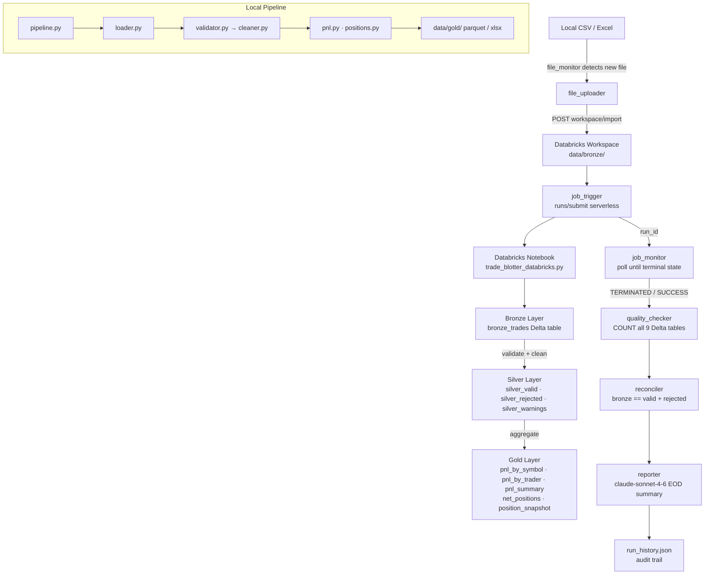

# Trade Blotter Pipeline


---

## Overview

**Trade Blotter Pipeline** is a production-grade Python data engineering platform for processing capital markets trade blotter data using the **medallion architecture** (Bronze → Silver → Gold). Raw trade files — equities, FX, and fixed income — are ingested from CSV or Excel, validated against strict schema and business rules, cleaned and normalised, then aggregated into P&L and net position outputs. A self-contained **DataOps agent** automates the full operational loop end-to-end: detecting new files, uploading them to Databricks, triggering a serverless PySpark notebook, polling for completion, running quality checks against Delta Lake tables, reconciling row counts across layers, and generating a Claude-powered end-of-day summary. Built for trading desks that need repeatable, auditable, automated data pipelines without manual intervention.

---

## Architecture



---

## Tech Stack

| Component | Technology |
|---|---|
| Language | Python 3.14 |
| Data processing | pandas, pyarrow |
| Orchestration | Custom DataOps agent (`agent/pipeline_agent.py`) |
| Cloud compute | Databricks Serverless (AWS) |
| Data storage | Delta Lake via Unity Catalog (`workspace.default`) |
| Spark | PySpark (Databricks Runtime 13.3 LTS) |
| SQL connectivity | `databricks-sql-connector` |
| AI summary | Anthropic Claude (`claude-sonnet-4-6`) |
| Excel output | openpyxl |
| Config | PyYAML |
| Secrets | python-dotenv |
| Testing | pytest |
| Package management | pip / setuptools |

---

## Project Structure

```
trade-blotter-pipeline/
│
├── src/trade_blotter/              # Installable Python package
│   ├── pipeline.py                 # Local orchestration entry point
│   ├── models/
│   │   └── trade.py                # Shared schemas: IngestResult, ValidationResult, field lists
│   ├── bronze/
│   │   └── loader.py               # load_csv / load_excel / load_directory — no transforms
│   ├── silver/
│   │   ├── validator.py            # Hard rejections + soft warnings; exact-duplicate handling
│   │   ├── cleaner.py              # Date parsing, numeric casting, side normalisation
│   │   └── writer.py               # Writes valid/rejected/warnings to data/silver/ as parquet
│   ├── gold/
│   │   ├── pnl.py                  # P&L by symbol, by trader, summary
│   │   ├── positions.py            # Net positions, position snapshot
│   │   ├── writer.py               # Writes gold outputs as parquet or database
│   │   └── excel_writer.py         # Multi-sheet Excel report
│   └── utils/
│       └── logger.py               # Shared logging configuration
│
├── agent/                          # DataOps agent — fully self-contained
│   ├── pipeline_agent.py           # Main orchestration loop (7 steps)
│   ├── config/
│   │   └── agent_config.yaml       # Databricks workspace, notebook path, table names
│   ├── memory/
│   │   └── run_history.json        # Append-only audit trail (gitignored)
│   └── tools/
│       ├── file_monitor.py         # Scan bronze/ for unprocessed CSVs
│       ├── file_uploader.py        # Upload CSV to Databricks workspace
│       ├── job_trigger.py          # Submit serverless notebook run
│       ├── job_monitor.py          # Poll run status until terminal state
│       ├── quality_checker.py      # COUNT(*) all 9 Delta tables
│       ├── reconciler.py           # bronze == silver_valid + silver_rejected
│       └── reporter.py             # Claude EOD Markdown summary
│
├── notebooks/
│   └── trade_blotter_databricks.py # PySpark notebook — installs pkg, runs pipeline, writes Delta
│
├── tests/
│   ├── bronze/test_loader.py       # 20 tests
│   ├── silver/test_validator.py    # 30 tests
│   ├── silver/test_cleaner.py
│   ├── silver/test_writer.py
│   ├── gold/test_pnl.py
│   ├── gold/test_positions.py
│   ├── gold/test_writer.py
│   ├── gold/test_excel_writer.py
│   ├── agent/test_file_monitor.py  # 11 tests
│   ├── agent/test_file_uploader.py # 12 tests
│   └── test_pipeline.py            # End-to-end integration
│
├── scripts/
│   └── run_pipeline.py             # CLI: python scripts/run_pipeline.py
│
├── config/
│   └── pipeline.yaml               # Source type, paths, gold output targets
│
├── data/
│   ├── bronze/                     # Raw source files (gitignored except seed data)
│   ├── silver/                     # Validated parquet outputs (gitignored)
│   └── gold/                       # Aggregated outputs (gitignored)
│
├── .env.example                    # Credential template
├── requirements.txt                # Runtime dependencies
├── requirements-dev.txt            # Dev/test dependencies
└── pyproject.toml                  # Package metadata and build config
```

---

## Running Locally

### 1. Clone and install

```bash
git clone https://github.com/rayyu56/trade-blotter-pipeline.git
cd trade-blotter-pipeline

python -m venv .venv
source .venv/bin/activate       # macOS / Linux
.venv\Scripts\activate          # Windows

pip install -r requirements.txt
pip install -r requirements-dev.txt   # adds pytest
```

### 2. Configure the pipeline

Edit `config/pipeline.yaml`:

```yaml
ingest:
  source_type: csv        # csv | excel | database
  source_path: data/bronze/

silver:
  fail_on_validation_error: false

gold:
  outputs:
    - pnl
    - positions
  target_type: parquet    # parquet | database
  output_path: data/gold/
```

### 3. Add source data

Place trade blotter files in `data/bronze/`. A sample file is included:

```
data/bronze/trades_20260401.csv
```

### 4. Run the pipeline

```bash
python scripts/run_pipeline.py
```

Outputs are written to `data/silver/` (validated parquet) and `data/gold/` (P&L, positions).

---

## Running the DataOps Agent

The agent is fully self-contained — it detects new files, uploads them to Databricks, triggers the notebook, and generates an EOD report automatically.

### 1. Configure credentials

```bash
cp .env.example .env
```

Edit `.env`:

```
DATABRICKS_HOST=https://<workspace>.azuredatabricks.net
DATABRICKS_TOKEN=dapi...
ANTHROPIC_API_KEY=sk-ant-...
```

Your Databricks token must have scopes: `clusters`, `jobs`, `sql`, `workspace`.

### 2. Review agent config

`agent/config/agent_config.yaml` controls the workspace URL, notebook path, SQL warehouse, Unity Catalog settings, and polling behaviour. Update if your workspace differs from the defaults.

### 3. Run the agent

```bash
# Process all new files in data/bronze/
python agent/pipeline_agent.py

# Preview without making any Databricks calls
python agent/pipeline_agent.py --dry-run

# Process a specific file
python agent/pipeline_agent.py --file data/bronze/trades_20260401.csv
```

### Agent execution steps

| Step | Tool | Action |
|---|---|---|
| 1 | `file_monitor` | Scan `data/bronze/` — skip files already successfully processed |
| 2 | `file_uploader` | Upload CSV to Databricks workspace `data/bronze/` |
| 3 | `job_trigger` | Submit serverless notebook run via REST API |
| 4 | `job_monitor` | Poll every 15s until `TERMINATED` or timeout (10 min) |
| 5 | `quality_checker` | `COUNT(*)` all 9 Delta tables via SQL warehouse |
| 6 | `reconciler` | Assert `bronze == silver_valid + silver_rejected` |
| 7 | `reporter` | Generate Claude EOD Markdown summary |

Results are appended to `agent/memory/run_history.json`.

---

## Running on Databricks

### Prerequisites

- Databricks workspace with Unity Catalog enabled
- Serverless compute available
- Git repo connected under **Workspace → Users → \<email\>**

### 1. Sync the repo

In the Databricks UI: **Workspace → Users → your email → trade-blotter-pipeline-repo** → Pull latest.

### 2. Trigger manually

Open `notebooks/trade_blotter_databricks.py` and click **Run All**.

The notebook:
1. Installs the `trade_blotter` package from GitHub `main`
2. Loads `data/bronze/trades_*.csv`
3. Runs Bronze → Silver → Gold
4. Writes all 9 Delta tables to `workspace.default`
5. Prints row counts and top P&L / positions

### 3. Trigger via agent

The agent (`pipeline_agent.py`) handles end-to-end automation — see [Running the DataOps Agent](#running-the-dataops-agent) above.

> **Note:** After merging changes to `main`, the notebook must be re-run (or triggered via the agent) to pick up the latest package version. Use `--force-reinstall` if pip has cached a previous build.

---

## Pipeline Outputs

### Delta Tables (Databricks — `workspace.default`)

| Table | Layer | Description |
|---|---|---|
| `bronze_trades` | Bronze | Raw trades exactly as ingested — all columns as strings |
| `silver_valid` | Silver | Rows that passed all validation rules |
| `silver_rejected` | Silver | Rows that failed hard rules (missing fields, bad dates, exact duplicates, etc.) |
| `silver_warnings` | Silver | Rows that passed but carry soft flags (missing broker, unrecognised asset class) |
| `gold_pnl_by_symbol` | Gold | Realised P&L aggregated by instrument symbol |
| `gold_pnl_by_trader` | Gold | Realised P&L aggregated by trader |
| `gold_pnl_summary` | Gold | Overall desk-level P&L summary |
| `gold_net_positions` | Gold | Net long/short position by symbol |
| `gold_position_snapshot` | Gold | Point-in-time position snapshot by symbol and date |

### Local Files

| Path | Format | Description |
|---|---|---|
| `data/silver/valid.parquet` | Parquet | Validated trades |
| `data/silver/rejected.parquet` | Parquet | Rejected rows with rejection reasons |
| `data/gold/pnl_*.parquet` | Parquet | P&L outputs |
| `data/gold/positions_*.parquet` | Parquet | Position outputs |
| `data/gold/trade_blotter_*.xlsx` | Excel | Multi-sheet formatted report |

---

## Test Coverage

```bash
pytest                          # run all tests
pytest tests/silver/            # run silver layer only
pytest tests/agent/             # run agent tools only
pytest -v                       # verbose output
```

| Test module | Tests | What it covers |
|---|---|---|
| `tests/bronze/test_loader.py` | 20 | CSV/Excel/directory loading, column validation, string preservation |
| `tests/silver/test_validator.py` | 30 | All hard rejection rules, exact duplicate handling, warnings |
| `tests/silver/test_cleaner.py` | — | Date parsing, numeric casting, side normalisation |
| `tests/silver/test_writer.py` | — | Silver parquet output |
| `tests/gold/test_pnl.py` | — | P&L aggregation correctness |
| `tests/gold/test_positions.py` | — | Net position calculations |
| `tests/gold/test_writer.py` | — | Gold parquet output |
| `tests/gold/test_excel_writer.py` | — | Multi-sheet Excel formatting |
| `tests/agent/test_file_monitor.py` | 11 | Dedup logic — all status cases, multi-file scenarios |
| `tests/agent/test_file_uploader.py` | 12 | API endpoint, auth, base64 payload, error handling (fully mocked) |
| `tests/test_pipeline.py` | — | End-to-end local pipeline integration |

---

## Git Workflow

```
main         ← stable, production-ready; Databricks notebook installs from here
  └── dev    ← integration branch; all features merged here first
        └── feature/<name>   ← individual feature branches
```

### Branch strategy

```bash
# Start a new feature
git checkout dev && git pull
git checkout -b feature/my-feature

# Open a PR into dev when ready, then dev → main for releases
```

### Commit convention

```
feat:     new feature
fix:      bug fix
refactor: code change, no behaviour change
test:     add or update tests
chore:    tooling, config, dependencies
```

---

## Repository

**GitHub:** [https://github.com/rayyu56/trade-blotter-pipeline](https://github.com/rayyu56/trade-blotter-pipeline)
